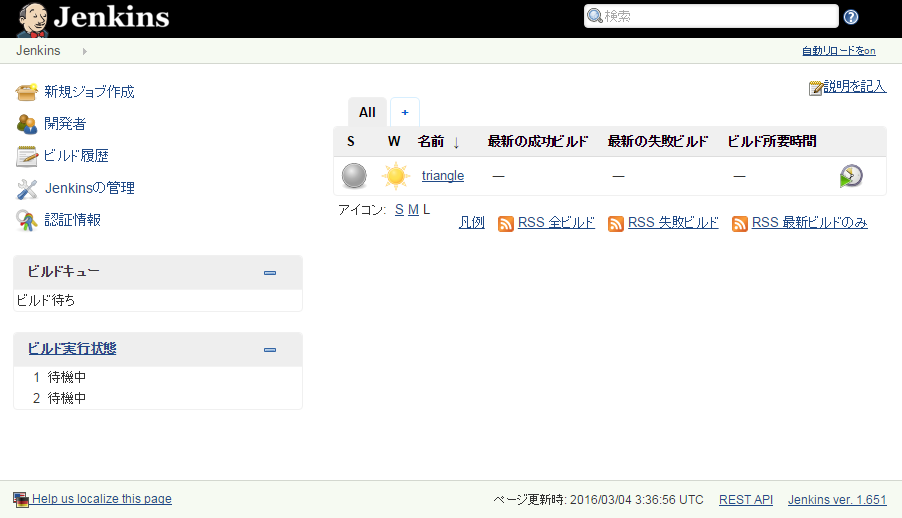

# PHP自動テストの学習用サンプル

[Template for Jenkins Jobs for PHP Projects][jenkins-php]
に沿ったPHPプロジェクト向けのJenkins環境を作成します

## セットアップ
前提：VirtualBox, Vagrantがインストール済みであること
```sh
$ git clone https://github.com/gmo-satof/php-test-study.git
$ cd php-test-study
$ vagrant up
```

ブラウザから下記URLにアクセス
```
http://192.168.33.190:8080
```

Jenkinsダッシュボードが表示され、triangleというジョブが登録されていればOK


※プロビジョニングの最後でjenkinsを再起動しているので、すぐに表示されない場合があります。

途中でエラーが発生した場合はプロビジョニングを再実行する
```sh
$ vagrant provision
```

[jenkins-php]: <http://jenkins-php.org/>
